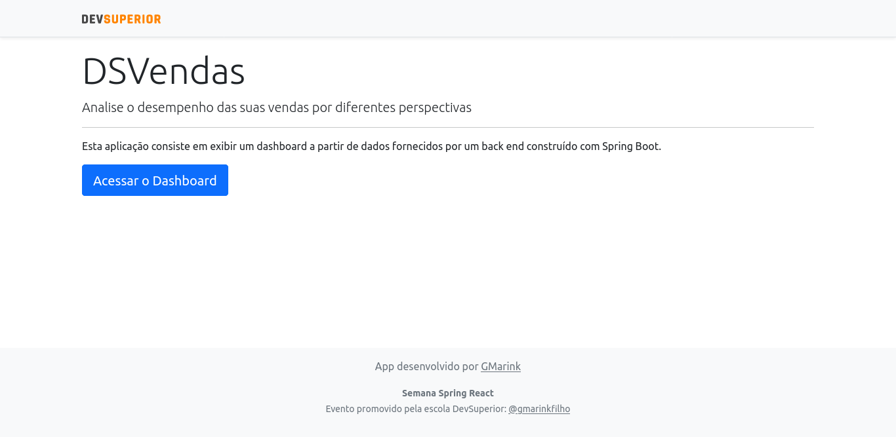
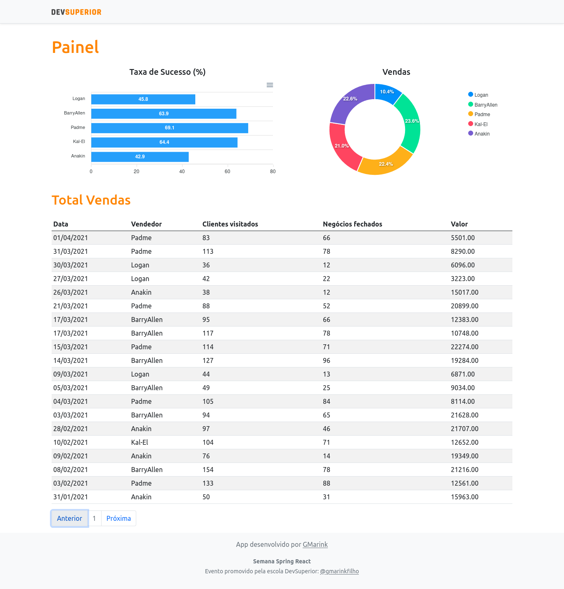

<h1 align="center">
    
</h1>

<h4 align="center">
  🚀 Semana Springboot React by DevSuperior
</h4>

  

  
  
  

  

  

  <a href="#rocket-tecnologias">Tecnologias</a>&nbsp;&nbsp;&nbsp;|&nbsp;&nbsp;&nbsp;
  <a href="#-projeto">Projeto</a>&nbsp;&nbsp;&nbsp;|&nbsp;&nbsp;&nbsp;
  <a href="#-layout">Layout</a>&nbsp;&nbsp;&nbsp;|&nbsp;&nbsp;&nbsp;
  <a href="#-como-contribuir">Como contribuir</a>&nbsp;&nbsp;&nbsp;|&nbsp;&nbsp;&nbsp;
  <a href="#memo-licença">Licença</a>

 
 

## :rocket: Tecnologias

Esse projeto foi desenvolvido com as seguintes tecnologias:

- [SpringBoot](https://springboot.io)
- [React](https://reactjs.org)
- [Lombok](https://projectlombok.org/)
- [PostgreSQL](https://www.postgresql.org/)

## 💻 Projeto

O Deshboard da SDS3 é um projeto que visa conectar desenvolvedores próximos a você que trabalham com as mesmas tecnologias.
 
## 🔖 Layout

  
  

## 🤔 Como contribuir

- Faça um fork desse repositório;
- Cria uma branch com a sua feature: `git checkout -b minha-feature`;
- Faça commit das suas alterações: `git commit -m 'feat: Minha nova feature'`;
- Faça push para a sua branch: `git push origin minha-feature`.

Depois que o merge da sua pull request for feito, você pode deletar a sua branch.

## :memo: Licença

Esse projeto está sob a licença MIT. Veja o arquivo [LICENSE](LICENSE.md) para mais detalhes.

---

Feito com ♥ 
Veja o projeto https://gmarink-sds3.netlify.app